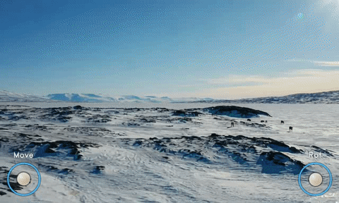
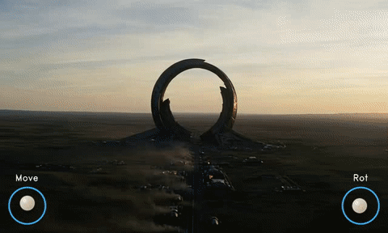
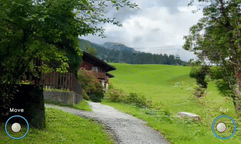
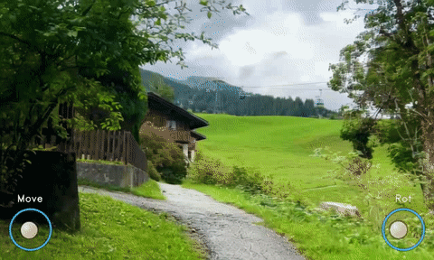
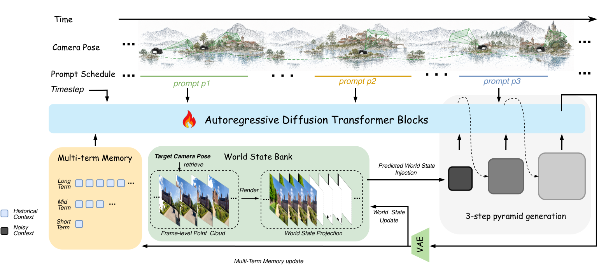

<h1 align="center">
  <picture>
    <source media="(prefers-color-scheme: dark)" srcset="examples/logo/logo_dark.png">
    
  </picture>
  EVOKE: Endless Interactive World with<br>Bounded State and Long-Horizon Supervision
</h1>

<p align="center">
  <a href="https://evoke-world.github.io/Evoke/"></a>
  <a href="LICENSE"></a>
  
  
  
</p>

<!-- TODO(release): add arXiv / HuggingFace / ModelScope badges once those links are public. -->

<p align="center">
  <b>A three-step, CFG-free world model that remembers where it has been, takes direction mid-flight,<br>
  and keeps going — 1.5 s of video every 2.11 s on a single H200.</b>
</p>

## ✨ Highlights

- 🏆 **State of the art on WBench** — as a *three-step* world model, while staying competitive in
  visual quality on **VBench-Long** and **VBench-2.0**.
- ⚡ **3 steps, zero CFG.** 1.5 s of 384×640 video every **2.11 s** on one H200 — one forward per
  step, not two. Few-step speed without few-step ceilings.
- 🌍 **Endless, not windowed.** Scene geometry lives in an external, camera-indexed **world state
  bank** instead of the denoiser's context. Only what the current view needs is retrieved, so the
  context stays *bounded* however long the session runs — no trading session length for memory.
- 🎛️ **Re-promptable mid-flight.** Per-chunk conditioning lets you change the prompt *while the
  rollout is running*: the sky ignites, the storm rolls in, no cut and no restart.
- 🧑‍🏫 **A teacher rebuilt for the long horizon.** Chunk-wise grouping + retrieval of distant frames
  + a linear-attention global state give **linear** memory and compute growth — which is what makes
  30 s self-forced supervision affordable, and what exposes the drift that still looks fine inside a
  short window.

## 🎬 Demos

Every clip was produced by the launchers in this repo, on the data bundled in `examples/` — no external
dataset, no cherry-picking across seeds. The `Move` / `Rot` joystick is the camera-control HUD burned
into `geo_pred.mp4`.

<!-- The demos are GIFs so they render straight from the repo, with no upload step and no dependency on
     GitHub's CDN (they also survive mirrors and offline clones). To upgrade them to real HTML5 players
     once the repo is public: drag the corresponding output/**/geo_pred.mp4 into any issue or PR comment
     box on a PUBLIC repo, copy the https://github.com/user-attachments/assets/<uuid> URL GitHub
     inserts, discard the comment without posting, and replace the  with
     <video src="<uuid-url>" controls width="300"></video>. Assets uploaded from a private repo are
     access-controlled and will not render for anonymous visitors. -->

### Re-prompting mid-rollout

Per-chunk conditioning lets the prompt change **while the rollout is running** — no cut, no restart.
Each schedule below switches at chunk 3 of 6 (213 frames, 8.9 s).

| | scene | the prompt switches to |
|---|---|---|
|  | frozen tundra, polar daylight | an aurora ignites across the whole sky |
|  | still mountain lake at night | a meteor shower opens overhead |
|  | alien valley of crystal spires | an electrical storm arcs between the spires |
|  | dormant ring megastructure | the gateway ignites, energy column rising |

```bash
MODE=segment NUM_CHUNKS=6 MAX_CASES=0 bash scripts/inference/infer_post_distill.sh
```

### Conditioning modes

4 chunks each (141 frames, 5.9 s; t2v is 140).

| | mode | input | camera |
|---|---|---|---|
|  | `v2v` | reference video + pose track | yes — continues past the reference window |
|  | `i2v` | single first frame + pose track | yes |
|  | `t2v` | prompt only | no — the engine forbids warp + t2v |

```bash
MODE=v2v NUM_CHUNKS=4 bash scripts/inference/infer_post_distill.sh   # or MODE=i2v / MODE=t2v
```

### The other two models

Both run on the same bundled inputs as the demos above, so they are directly comparable.

| | model | steps | note |
|---|---|---|---|
|  | `stage1_camera_control` | 8 | the multi-step model that precedes distillation, same case as `v2v` |
|  | `evoke_teacher` | 50 | the dual-expert DMD teacher sampled directly, same input image as `i2v`; no camera conditioning |

```bash
NUM_CHUNKS=4 bash scripts/inference/infer_stage1.sh
bash scripts/inference/infer_evoke_teacher.sh
```

## 🧠 How it works

<p align="center"></p>

The student is autoregressive over latent chunks (`latent_window_size = 9`). Each chunk is laid out
along the RoPE frame index as:

```
prefix | long(16) | mid(2) | warp(W) | prev_short(1) | noise(W)
```

| tier | what it is |
|---|---|
| `prefix` | the frame-0 global anchor (i2v: the input image; v2v: the first latent of the reference video) |
| `long` / `mid` | multi-term parametric memory (`history_sizes = [16, 2, 1]`) with coarser patch kernels — long `(4,8,8)`, mid `(2,4,4)`, everything else `(1,2,2)` |
| `warp` | the world state bank rendered into this view; its RoPE overlaps the noise window |
| `prev_short` | the last latent of the previous chunk, the continuity anchor closest to the noise |

Every tier lives at the same latent resolution (`res/8`); compression comes only from the patchify
convolution kernel, and no low-resolution latents are stored. In the short tier
`[prefix | warp | prev_short]` the residual MLP and the per-stage compression act only on the warp
frames in the middle.

The world state bank itself has three operations: **write** — a monocular depth model estimates depth
for the emitted chunk under its known poses, unprojected into a persistent point cloud; **read** — the
current camera pose addresses the bank directly, with sources ranked by co-visibility, up to eight
fused, and a batched z-buffered scatter returning a warped image plus a per-pixel visibility mask; and
**evict** — an optional retention window, which hour-scale runs enable explicitly.

## ⚙️ Environment

Python 3.10 + CUDA 12.4. The versions in `requirements.txt` are **the environment actually in use**,
not aspirational ones: torch 2.4 / deepspeed 0.14.5 / flash-attn are load-bearing, because the
attention path and the manual ZeRO-2 reduction interleaving are written against them.

```bash
git clone <repo-url> && cd EVOKE
pip install torch==2.4.0 torchvision==0.19.0 --index-url https://download.pytorch.org/whl/cu124
pip install -r requirements.txt
```

Two things `pip` will not do for you:

- `diffusers` is pinned to a development version that is not on PyPI — install the fork this repo was
  developed against before anything else will import.
- `postprocess_viz.py` shells out to the **`ffmpeg` binary** for the streaming concat path, so it has
  to be on `PATH` (there is a slower OpenCV fallback).

The depth backend behind the bank is **[ViGeo](https://huggingface.co/pkqbajng/ViGeo)**, and it is
what every shipped recipe uses (`DEPTH_BACKEND=vigeo` in both launchers, `cloud_warp.backend: vigeo`
in every training config). The source is **vendored** at `evoke/third_party/vigeo`, so only the
weights are needed: put `vigeo.pt` in `models/ViGeo1.1`, or point `EVOKE_VIGEO_WEIGHTS` at it
(`EVOKE_VIGEO_SRC` overrides the source tree).

**[Depth-Anything-3](https://huggingface.co/spaces/depth-anything/depth-anything-3) is optional** —
you only need it if you set `DEPTH_BACKEND=da3`. Nothing in the default path touches it, so skip the
download unless you are switching backend. It is vendored the same way at `evoke/third_party/da3`,
with weights in `models/DA3` (`EVOKE_DA3_SRC` / `EVOKE_DA3_WEIGHTS`).

Both trees carry their own `LICENSE` and `PROVENANCE.md`. Switching backend is a **recipe change**,
not a speed knob — training and inference must agree on it.

If a launcher stops at `[preflight] FATAL: ... cannot import torch + cv2`, point it at the right
interpreter: `EVOKE_PYTHON_BIN=<your-env>/bin bash scripts/inference/...`.

## 📦 Weights

`models/` is not in version control — obtain the weights separately and lay them out like this. Every
released directory is the **parent of a `transformer/` directory**, because the loader resolves it as
`from_pretrained(TRANSFORMER_PATH, subfolder="transformer")`; passing `.../transformer` itself will not
resolve.

```
models/
├── evoke-base/                                   base model (also supplies vae / scheduler / text_encoder)
├── evoke-distilled/                              few-step init for stage-2 distillation
├── ViGeo1.1/                                     depth backend weights -- REQUIRED (every shipped recipe)
├── DA3/                                          depth backend weights -- OPTIONAL (only for DEPTH_BACKEND=da3)
└── evoke/
    ├── stage1_camera_control/transformer/        multi-step camera-controllable model (8 steps)
    ├── stage2_few_step_training/transformer/     few-step distillation (3-step pyramid)
    ├── stage3_long_distillation/transformer/     30s long-video distillation (post-distill init)
    ├── stage3_post_distillation/transformer/     the shipped model -- continued from long distillation
    └── evoke_teacher/{high,low}_noise/           the two DMD teacher experts — training only
```

Which recipe produces which artifact (the released stage numbering counts released models, so it does
not line up one-to-one with the training script names):

| Released weights | Produced by | Config |
|---|---|---|
| `evoke/stage1_camera_control` | `train_stage1.sh` | `configs/training/stage1/stage1.yaml` |
| *(intermediate, not released)* | `train_stage2.sh` — NaViT pyramid | `configs/training/stage2/stage2.yaml` |
| `evoke/stage2_few_step_training` | `train_fewstep_distill.sh` | `configs/training/stage3/fewstep_distill.yaml` |
| `evoke/stage3_long_distillation` | `train_longvideo_30s_distill.sh` | `configs/training/stage3/longvideo_30s_distill.yaml` |
| `evoke/stage3_post_distillation` | `train_longvideo_30s_distill.sh` with a post-distill config | `configs/training/stage3/post_distill{,_warm750,_warm1250}.yaml` |

Training runs write to `models/train/<same-name>/`; move or symlink a checkpoint into `models/evoke/`
once you want to serve it. Artifacts are fp32 safetensors, converted on load per `torch_dtype` (the
engine currently pins bf16; see `weight_dtype` in `infer_single.py`).

## 🚀 Inference

| MODE | Input | pose / warp |
|---|---|---|
| `v2v` (default) | reference video + pose trajectory | ON |
| `i2v` | first frame + pose trajectory | ON |
| `t2v` | prompt only | **OFF** (the CLI rejects warp + t2v) |

| Launcher | Weights | Steps |
|---|---|---|
| `infer_post_distill.sh` | `models/evoke/stage3_post_distillation` | 3 |
| `infer_stage1.sh` | `models/evoke/stage1_camera_control` | 8 |
| `infer_evoke_teacher.sh` | `models/evoke/evoke_teacher` | 50 (example only) |

Only `stage1` has all three modes in distribution (`geo_condition_t2v_ratio=0.1` /
`geo_condition_i2v_ratio=0.2`); both distilled models were trained on v2v alone (both ratios 0), so
`MODE=i2v|t2v` there is **zero-shot extrapolation** and the scripts print a warning.

Length is set by `NUM_CHUNKS` — one chunk is 36 frames = 1.5 s @24fps, so `NUM_CHUNKS=20` is a 30 s
clip. `NUM_FRAMES` is the older knob and only picks the chunk count; it does not bound the output.

Common env vars: `LOCAL_GPUS` (shards by case), `MAX_CASES` (default 8, `0`=all), `TRANSFORMER_PATH`,
`OUT_ROOT`, `SEED`, `EVOKE_PYTHON_BIN`. Every launcher has `-h`. Results land in
`<OUT_ROOT>/<case>/geo_pred.mp4`, and the checkpoint plus recipe behind a directory is recorded in
`<OUT_ROOT>/run_info.json`.

3 steps and CFG-off are properties of the distilled weights, not knobs: the step count comes from
`STAGE2_STEPS`, and raising `NUM_INFERENCE_STEPS` does nothing (the launcher warns).

The mode × model matrix, hour-scale rollouts, the input format for your own data and the per-chunk log
format are documented in [`scripts/inference/README.md`](scripts/inference/README.md).
Single clip: `python scripts/inference/infer_single.py --help`.

## 🗝️ Training

```bash
bash scripts/training/train_stage1.sh                  # camera-controllable long context   zero2_1x8
bash scripts/training/train_stage2.sh                  # NaViT pyramid (coarse-to-fine)     zero2_1x8
bash scripts/training/train_fewstep_distill.sh         # few-step DMD distillation          zero2_1x8
bash scripts/training/train_longvideo_30s_distill.sh   # 30s long-video DMD distillation    zero2_6x8
```

All four recipes point at `configs/data/sample.yaml` (or `sample_segprompts.yaml`), which is the single
60 s clip bundled under `examples/data/` — so they start and train with no external dataset. That is a
pipeline check, not a training run: one clip overfits immediately. For a real run swap `data_yaml_path`
to the production mix named in the comment next to it (`mix_4src.yaml` for stage 1/2,
`mix_3src_pose.yaml` / `mix_3src_segprompts.yaml` for stage 3), which carry the full source mix, the
per-source path handling and the tuned sampling ratios.

Each launcher names its config in the header; see the table under [Weights](#-weights) for which one
produces which released artifact. To change scale, change `ACCELERATE_CONFIG` — the topology is baked
into the accelerate yaml, so do not override it with `--num_machines`; for multi-node runs the platform
injects `RANK / MASTER_ADDR / MASTER_PORT`.

Post-distillation continues from a long-distillation checkpoint and reuses the same launcher with a
different config:

```bash
TRAINING_CONFIG=configs/training/stage3/post_distill.yaml \
  bash scripts/training/train_longvideo_30s_distill.sh
```

Merging a LoRA checkpoint into a full transformer (for warm starts or for release):

```bash
python tools/merge_lora_ckpt.py --base <base-root> --ckpt <checkpoint-dir> --dst <out-dir> \
  --dtype fp32 --lora_rank 128 --lora_alpha 128 \
  --no_include_patch_embedding --include_multi_term_memory_patchg_lora
```

> `--dtype fp32` is not optional: the LoRA delta is only ~5e-4 of the weight magnitude, and storing
> it as bf16 swallows most of it in the ULP.

## 🗂️ Layout

```
train_evoke.py                          training entry point (multi-term memory + chunk assembly)
evoke/modules/transformer_evoke.py      DiT: patch_long/mid/short, short-tier split, sync pyramid
evoke/modules/geometric_state/          the camera-indexed world state bank: write / read / evict
evoke/modules/evoke_teacher/            chunk-sparse DMD teacher (dual expert) + sequence parallelism
evoke/pipelines/pipeline_evoke.py       rollout: per-chunk assembly, RoPE, visibility
evoke/dataset/online_materialize.py     warp rendering (ViGeo/DA3) + per-tier VAE encoding
scripts/inference/infer_*.sh            one batch launcher per released model
scripts/inference/infer_batch.py        jsonl shard worker (shared by all launchers)
scripts/inference/infer_single.py       single-clip engine CLI
scripts/inference/postprocess_viz.py    rendering/encoding (detachable, overlaps the next sample's GPU work)
tools/merge_lora_ckpt.py                LoRA ckpt -> full transformer
configs/{training,accelerate,deepspeed,data,scheduler}/
evoke/third_party/{da3,pi3,vigeo}/      vendored third-party code, each with LICENSE + PROVENANCE.md
examples/{i2v,t2v,v2v,segment_prompts}/ bundled inference cases, one per mode
examples/data/                          one 60s training clip (video + pose + caption) for a runnable recipe
examples/logo/                          logo + inference pipeline figure
```

## 📝 Notes

- Resolution is data driven: change `single_height/single_width` and every tier follows
  (latent = `res/8`). Keep the width a **multiple of 64** so the long tier (stride-8 patch) and the
  quarter-resolution pyramid stage both divide evenly.
- Inference defaults to `guidance_scale = 1` (the model is warp-dominant); raise it if you need to.
- **The warp / attention recipe must match between training and inference.** A mismatch silently
  degrades image quality rather than merely being slower — every knob in the launchers is annotated
  with the config field it mirrors.
- Eviction is off by default: unless a retention window is requested the bank simply grows, and
  per-tick render cost stays bounded only because recall fuses a fixed number of sources.

## 👍 Acknowledgement

This codebase is a derivative of **[Helios](https://github.com/PKU-YuanGroup/Helios)**
(PKU-YuanGroup, [arXiv:2603.04379](https://arxiv.org/abs/2603.04379)) — `models/evoke-base` is a copy
of their released Helios-Base weights (see `models/evoke-base/PROVENANCE.md`), and the pipeline,
transformer and scheduler modules carry their original copyright notices alongside ours. Helios is in
turn built on the **Wan** family, which supplies the VAE and text encoder.

The vendored geometry dependencies are **Depth-Anything-3**, **Pi3** and **ViGeo**, each kept under
`evoke/third_party/` with its own `LICENSE` and `PROVENANCE.md`.

Rendering previously observed content into the target view, aligning its positions with the target
frames, and selecting history tokens by a visibility mask all follow prior warp-as-history
conditioning; we adopt those mechanisms and claim none of them. What EVOKE adds is the connection of
that conditioning interface to a session-persistent point store with explicit read, write and eviction
operations, and its joint training with a few-step student.

## 🔒 License

Apache-2.0, see `LICENSE`. Vendored third-party code keeps its own license and provenance under
`evoke/third_party/*`.

## ✏️ Citation

<!-- TODO(release): fill in the arXiv eprint id once the preprint is public. -->

```bibtex
@article{evoke2026,
  title = {EVOKE: Endless Interactive World with Bounded State and Long-Horizon Supervision},
  year  = {2026},
}
```
